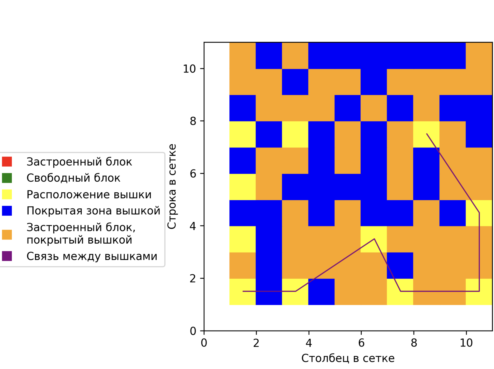
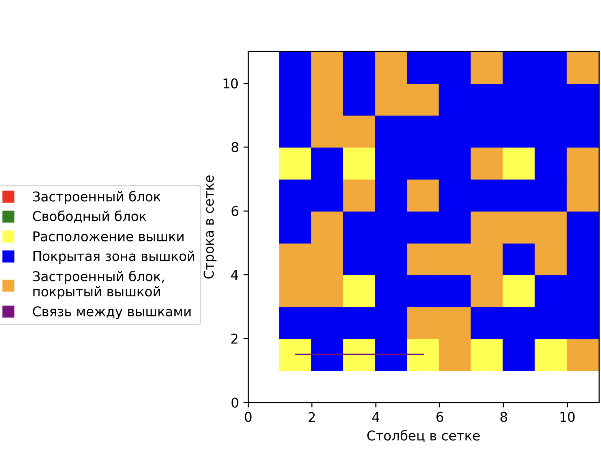
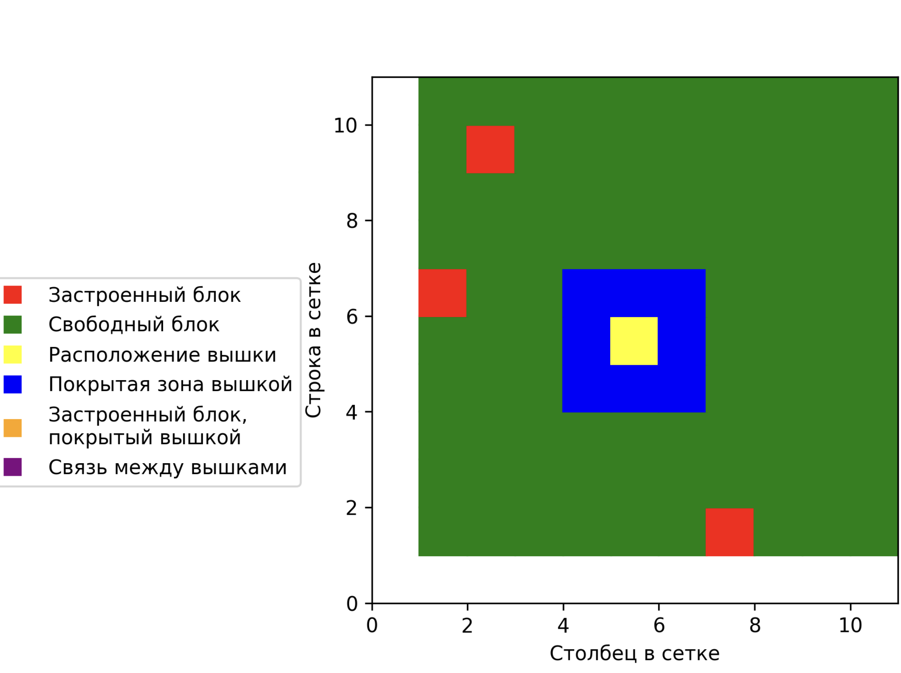

# Проект City Grid

### Описание
Представим, что телекоммуникационная компания разрабатывает эффективную сеть 7G для нового города. Город может быть представлен в виде сетки, где некоторые блоки загорожены и не могут иметь вышки, в то время как другие могут. Цель проекта - обеспечить максимальное покрытие с минимальным количеством вышек.

### Функционал проекта

- Возможность представлять город в виде сетки размером N x M. При инициализации класса загороженные блоки случайным образом размещаются с покрытием >30% (этот параметр можно изменить).

- Возможность устанавливать вышки с некоторым радиусом покрытия для покрытия города эффективной сетью 7G

- Есть функция выбора: автоматическое размещение вышек, либо в ручную

- Реализована возможность прокладки сети между выбранными двумя вышками 

- Управление проектом происходит из админ зоны, для этого необходимо создать супер пользователя (интрукцию см ниже)

- Для визуализации городской сети необходимо нажать на кнопку "Показать визуализацию" в админ панели в разделе "Городские сетки"

### Технологии
- Python 3.10
- Django 4.2.7
- matplotlib 3.8.1

### Как запустить проект:

Клонировать репозиторий и перейти в него в командной строке:

```
git clone git@github.com:OlegMusatov3000/telecom_project.git
```

```
cd telecom_project
```

Cоздать виртуальное окружение:

- Команда для Windows

```
python -m venv venv
```

- Для Linux и macOS:

```
python3 -m venv venv
```

Активировать виртуальное окружение:

- Команда для Windows:

```
source venv/Scripts/activate
```

- Для Linux и macOS:

```
source venv/bin/activate
```

Установить зависимости из файла requirements.txt:

```
python3 -m pip install --upgrade pip
```

```
pip install -r requirements.txt
```

Перейти в папку с файлом manage.py:

```
cd telecom_project
```

Выполнить миграции:

```
python3 manage.py migrate
```

Создать супер пользователя:

```
python3 manage.py createsuperuser
```

Запустить проект:

```
python3 manage.py runserver
```

**_Ссылка на [админ-зону](http://127.0.0.1:8000/admin/ "Гиперссылка к админке.")_**

### Скриншоты программы

- 

- 

- 

### Автор
- Олег Мусатов
- Tg: @OlegMusatov